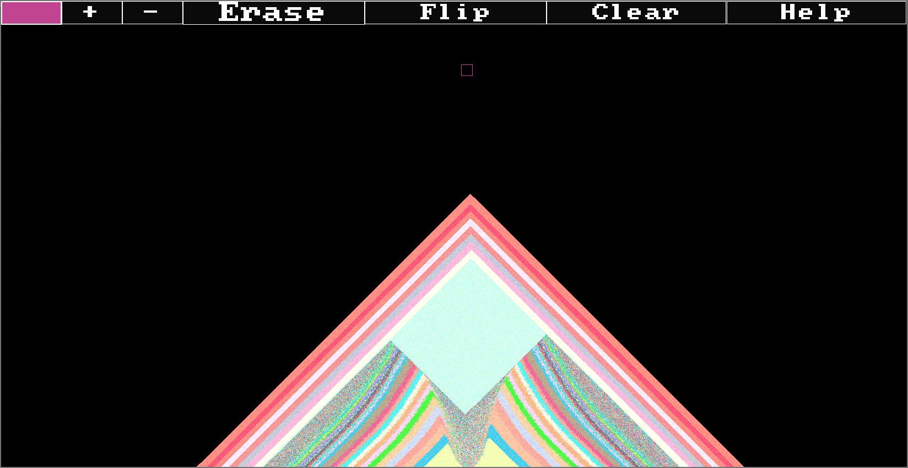

# Maximal Sand

Maximal Sand is a simple sand simulation game written in C++ using SDL2, This Game is designed for WebAssembly and can be compiiled with Emscripten.

## How to Build Natively

I have only used the native build for testing, I can confirm it works on Linux.

1. Install SDL2, cmake, and a C++ compiler
2. In the root directory make a directory named 'build'
3. In the 'build' directory run `cmake ..`
4. Run `make` in the 'build' directory

## How to build for Emscripten

1. Install emscripten, SDL2, cmake, and a C++ compiler
2. In the root directory make a directory named 'build'
3. In the 'build' directory run `emcmake cmake ..`
4. Run `make` in the 'build' directory

After building there will be 2 files 'MaximalSand.wasm' and 'MaximalSand.js'
the JS contains the code needed to load the WASM file using WebAssembly. The WASM version expects a canvas on the page with the id `canvas`
It also depends on the target browser supporting WASM multithreading and the proper server headers being set, If you want to build a version without multithreading you can set the SINGLETHREAD option as described below.

## The included Shell

This project includes a shell in 'index.html'.
the. The shell requires both the multithreaded and the singlethreaded versions. The single threaded versions artifects should be prefixed with _st on the end of the filename. All artifects and the shell should be in the same directory.

## Build Options

There are some CMake options that can be used to build the project:

`-D SINGLETHREAD=ON` this builds the single threaded version of the application, it is slower but is compatible with more browsers.
`-DCMAKE_BUILD_TYPE=Debug` this builds the application for debugging.
`-DCMAKE_BUILD_TYPE=Release` this builds the release version, It is faster than the debug version.
